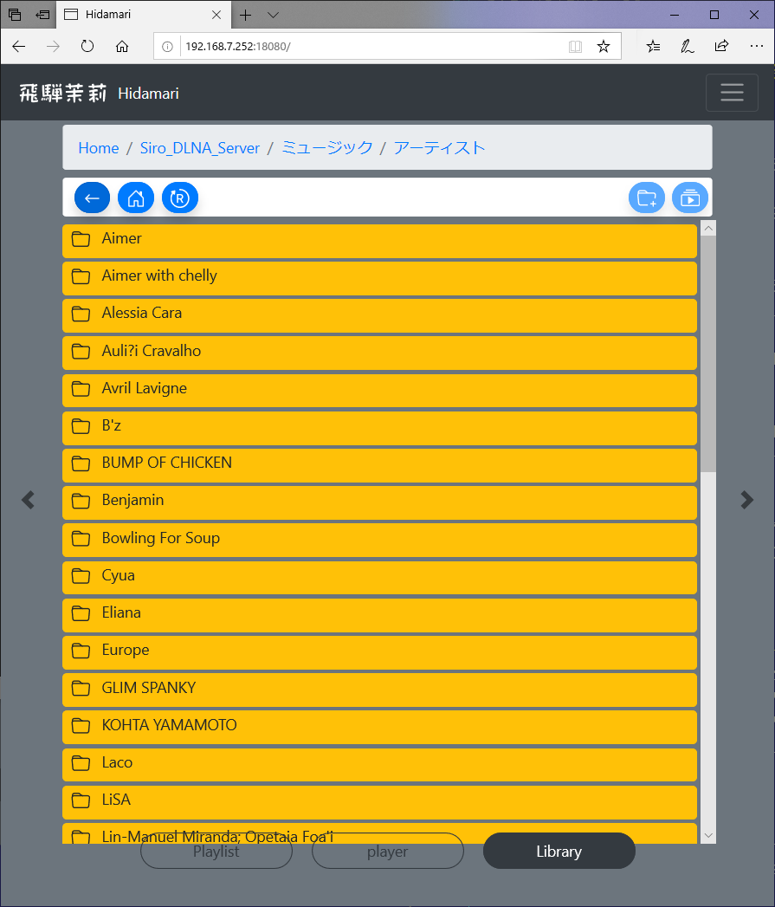
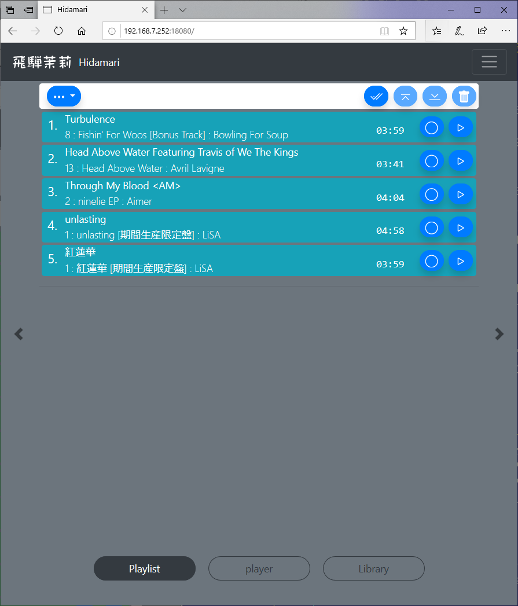
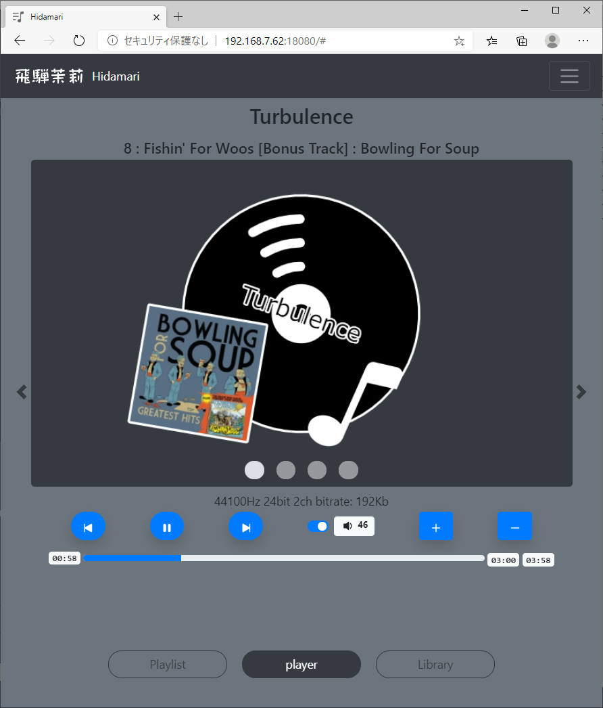

# HIDAMARI 

HIDAMARI is the mdp controler.

You can control MPD from your PC or Futurephone browser.

You can easily select songs from the library, operate the playlist, and play/stop songs.

Also, visual animations will make you feel better while you play.

# Screen Shot

## library

 - 
 - 

## Playlit

 - 
 - 
 - 
 
 
 ## Player

 - 
 - 
 - 
 - 
 - 
 -  full screen mode
 
 
 
