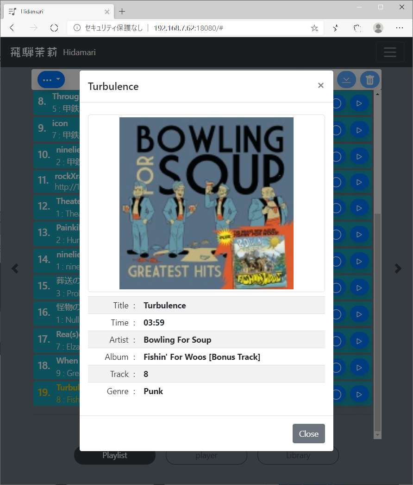
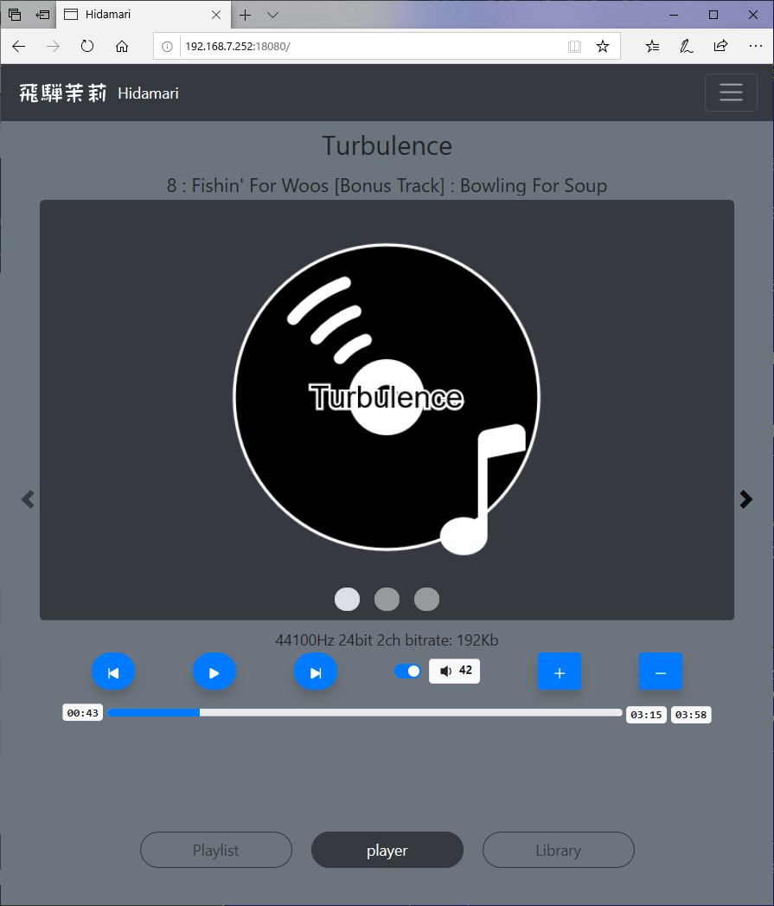
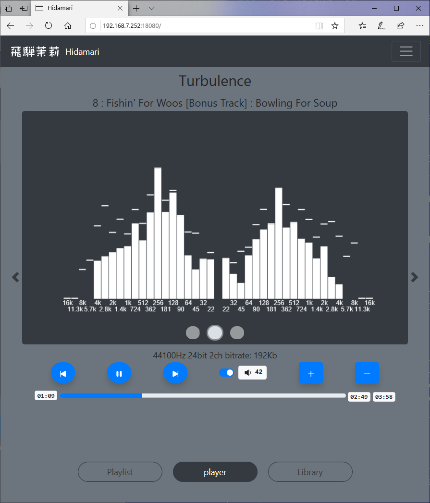
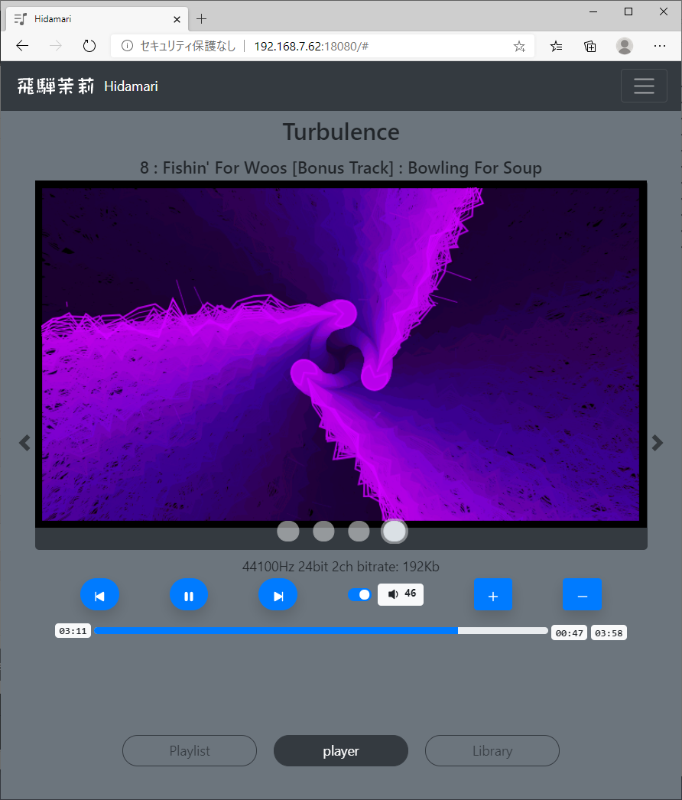

# HIDAMARI


HIDAMARI is a controller for MPD( music player daemon).

You can control MPD from your PC or Futurephone browser.

You can easily select songs from the library, manipulate the playlist and play/stop the songs.

Also, the visual animations will make you feel good while playing.

Japanese document is [here](./README.md)

# Demo Movie

It is under development.

[YouTube](https://youtu.be/_FmcRL2XlY8)

# Screen Shot

It is under development.

## library

 - 
 - 

## Playlit

 - 
 - 
 - 

 ## Player

 - 
 - 
 -  spectrum visualize
 -  spectrum visualize
 -  spectrum visualize
 -  spectrum visualize full screen mode

# Feature

 - It is implemented by RUST. It is basically a web service with tokio, hyper and wrap.
 - You can play/stop the playlist, adjust the volume, edit the playlist, view the library, and perform other basic MPD operations via a browser. In addition, the websocket is used to send the MPD status and spectrum information to the browser in real time.
 - The MPD's FIFO output is used to FFT-analyze the PCM data and send the spectral information to the browser. This allows the browser to visualize the spectral information of the music.
 - PCM data input from ALSA can be converted to an http stream by HIDAMARI and played back by MPD. This makes it possible to play back the line input of the sound source board, and by using [bluealsa](https://github.com/Arkq/bluez-alsa), you can also play back music from other Bluetooth devices in MPD format.
    - ALSA to input seems to be enhanced in MPD 0.22.x, but it doesn't work well with the current release of MPD 0.21.x.
 - The FIFO output of the MPD can be redirected from HIDAMARI directly to the ALSA output. This allows you to use [bluealsa](https://github.com/Arkq/bluez-alsa) to play music on other Bluetooth devices.
    - Output to ALSA can also be done with MPD, but since output devices cannot be added dynamically, the MPD must be restarted each time, which is not necessary with HIDAMARI.
 - The HTTP output of the MPD can be proxied by HIDAMARI. This allows you to get the HTTP output of the MPD using the same path as the http access to HIDAMARI.
 - You can manage your bluetooth devices from your browser. bluetooth pairing can be done from your browser.
    - MPD can be used as a Bluetooth music source or as a Bluetooth speaker in the browser.
 - You can get album art. Album art can be retrieved from either local music file tag data, an image file on a local directory, or a UPNP server (DLNA server).
    - Album art seems to be enhanced in MPD 0.22.x, but it doesn't work well in the current release of MPD 0.21.x.
 - All operations on MPD and HIDAMARI can be done in http REST format from JavaScript and so on. This makes it possible to customize the UI in your own way. You can also customize the visualization of vector information.

# Build and Run.

## Debian or Raspbian ( Raspberry Pi OS )

 - Install the following
    - mpd
    - bluez
    - bluealsa

 - By using the FIFO output of mpd, make the following settings in /etc/mpd.conf and restart mpd.
```
audio_output {
    type                    "fifo"
    name                    "my_fifo"
    path                    "/tmp/mpd.fifo"
    format                  "44100:16:2"
}
```
```
$ systemctl restart mpd.service
```

 - To enable the bluealsa profile, modify the /lib/systemd/system/bluealsa.service script as follows
```
[Unit]
Description=BluezALSA proxy
Requires=bluetooth.service
After=bluetooth.service
[Service]
Type=simple
User=root
ExecStart=/usr/bin/bluealsa -p a2dp-source -p a2dp-sink
```
```
$ systemctl daemon-reload
$ systemctl restart bluealsa.service
```

 - Install the libraries needed for the build.
```
$ apt-get install libasound2-dev libflac-dev libflac8 libogg-dev libogg0
$ apt-get install libdbus-1-dev libdbus-1-3 libsystemd-dev libsystemd0 liblz4-dev liblz4-1 liblzma-dev liblzma5 libgcrypt20-dev libgcrypt20 libgpg-error-dev libgpg-error0
```

    - You need the following libraries
    - libasound2-dev
    - libflac-dev libflac8
    - libogg-dev libogg0
    - libdbus-1-dev libdbus-1-3
    - libsystemd-dev libsystemd0
    - liblz4-dev liblz4-1
    - liblzma-dev liblzma5
    - libgcrypt20-dev libgcrypt20
    - libgpg-error-dev libgpg-error0

 - For libflac, do the following to avoid a compile error
```
$ cd /usr/lib/x86_64-linux-gnu
or
$ cd /usr/lib/arm-linux-gnueabihf
```
```
$ ln -s libFLAC.so libflac.so
```

 - Get the source and compile it.
```
$ git clone https://github.com/zuntan/hidamari.git
$ cd hidamari
$ cargo build --release
```

    - If possible, compile with --release. If you compile with --debug, the CPU load is high and the execution is slow.

 - Add a bluetooth group to the group of executing (or compiling) users. Without this, you will not be able to control bluetooth from HIDAMARI.
```
$ usermod -G bluetooth -a <<User>>
```

 - Check hidamari.conf. See below for the values in hidamari.conf.

 - Execution.
```
$ cargo run --release
```

## Debian cross-build for Raspberry Pi

 - As a prerequisite, you should be able to compile with Debian as described above.

 - Install a toolchain. For example, install ~/gcc-arm-8.3-2019.03-x86_64-arm-linux-gnueabihf.
```
$ cd ~
$ wget https://dl.armbian.com/_toolchains/gcc-arm-8.3-2019.03-x86_64-arm-linux-gnueabihf.tar.xz
$ tar xvJf gcc-arm-8.3-2019.03-x86_64-arm-linux-gnueabihf.tar.xz
$ vi ~/.profile
export PATH="$HOME/.cargo/bin:$HOME/gcc-arm-8.3-2019.03-x86_64-arm-linux-gnueabihf/bin:$PATH"
```

 - Add the raspbian repository to the APT system.
```
$ cat <EOT > /etc/apt/sources.list.d/raspbian.list
deb [arch=armhf] http://archive.raspbian.org/raspbian jessie main contrib non-free
EOT
$ wget https://archive.raspbian.org/raspbian.public.key -O - | apt-key add -
$ dpkg --add-architecture armhf
$ dpkg --print-foreign-architectures
```

 - Implements a library for armhf.
```
$ apt-get update
$ apt-get install libasound2-dev:armhf libflac-dev:armhf libflac8:armhf libogg-dev:armhf libogg0:armhf
$ apt-get install libdbus-1-dev:armhf libdbus-1-3:armhf libsystemd-dev:armhf libsystemd0:armhf liblz4-dev:armhf liblz4-1:armhf liblzma-dev:armhf liblzma5:armhf libgcrypt20-dev:armhf libgcrypt20:armhf libgpg-error-dev:armhf libgpg-error0:armhf
```

 - For libflac, do the following to avoid a compile error
 ```
$ cd /usr/lib/arm-linux-gnueabihf
$ ln -s libFLAC.so libflac.so
```

 - Build with cargo. We need to set some environment variables.
```
$ export PKG_CONFIG_armv7_unknown_linux_gnueabihf=1
$ export PKG_CONFIG_PATH_armv7_unknown_linux_gnueabihf=/lib/arm-linux-gnueabihf/pkgconfig
$ cargo build --release --target armv7-unknown-linux-gnueabihf
```

 - Check the built file.
```
$ file target/armv7-unknown-linux-gnueabihf/release/hidamari
target/armv7-unknown-linux-gnueabihf/release/hidamari: ELF 32-bit LSB shared object, ARM, EABI5 version 1 (SYSV), dynamically linked, interpreter /lib/ld-linux-armhf.so.3, for GNU/Linux 3.2.0, with debug_info, not stripped
```

 - Transfer the generated executable file to your Raspberry Pi and then run it on your Raspberry Pi.

# Files needed for execution

 - hidamari
    - executable program
 - hidamari.conf
    - Configuration file. The hidamari.conf in the same directory or in /etc is referenced. (You can also specify it as the first argument at runtime.)
 - hidamari_dyn.conf
    - Dynamic configuration file. The configuration file is saved each time you change the settings on the UI. You can specify the location in hidamari.conf. By default, it is the same directory as the execution of the main application.
 - _contents
    - It contains html, javascript, etc. for use with hidamari. You can specify the directory location in hidamari.conf. By default, it is the same directory as the main execution.

# hidamari.conf

 - The file format is toml.
```
#
# The format of this file is TOML.
#
config_dyn          = "hidamari_dyn.conf"
bind_addr           = "0.0.0.0:18080"
mpd_addr            = "127.0.0.1:6600"
mpd_httpd_url       = "http://127.0.0.1:8080"
self_url_for_mpd    = ""
mpd_protolog        = false
mpd_fifo            = "/tmp/mpd.fifo"
mpd_fifo_fftmode    = 0
contents_dir        = ""
albumart_upnp       = false
albumart_localdir   = "/var/lib/mpd/music"
```
    - config_dyn : file path
        - Specify the file path for hidamari_dyn.conf.
    - bind_addr : ipaddr
        - Specify the port on which HIDAMARI listens for HTTP services.
    - mpd_addr : ipaddr
        - Specify the service listen port of MPD from HIDAMARI's point of view.
    - mpd_httpd_url : URI
        - Specifies the listen port for the HTTP stream service in MPD as seen by HIDAMARI. This will be used for stream proxies. If you don't need it, set it to "".
    - self_url_for_mpd : ipaddr
        - Specify the HIDAMARI alsa stream protocol to be presented to MPD. If this value is "", then http://127.0.0.1:<<bind_addr's port value>> will be used. This is the URL prefix for the HIDAMARI HTTP service from MPD's point of view.
    - mpd_protolog : true/false
        - This switch is used to log the execution of MPD commands.
    - mpd_fifo : File path
        - Specifies the path to the MPD FIFO pipe.
    - mpd_fifo_fftmode : 0 - 5
        - Specifies the mode of FFT processing. Normally 0. (Buffer size: 4096, buffer slide size: 2048, frequency resolution: 1/2 oct )
        - Changing the value changes the buffer size, buffer slide size and frequency resolution of the FFT process. The higher the number, the worse the accuracy is, and the lower the load is.
    - contents_dir : File path.
        - The directory path to the directory where hidamari html, javascript, etc. are stored. If this value is "", the current path /_contents is referenced.
    - albumart_upnp : true/false
        - If the database of MPD is upnp, set this to true.
    - albumart_localdir : File path
        - When albumart is acquired, albumart is acquired from the music files under the specified directory.

# API.

todo.

# Implementation Overview

todo.

# See also
 - blog
    - https://zuntansan.hatenablog.jp/
