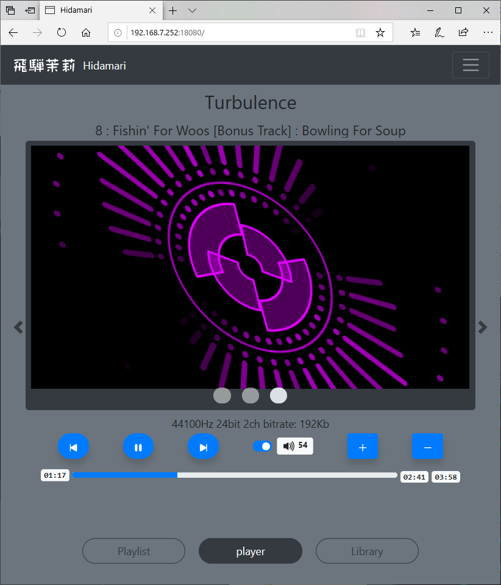

# HIDAMARI


HIDAMARI は MPD( music player daemon) の コントローラーです。

PCまたはFuturephoneブラウザからMPDを制御できます。

ライブラリから曲を簡単に選択し、プレイリストを操作して、曲を再生/停止できます。

また、視覚的なアニメーションは、プレイ中に気分を良くします。

英語ドキュメントは[コチラ](./README.md)です。

# デモムービー

開発中のものです。

[YouTube](https://youtu.be/_FmcRL2XlY8)

# スクリーンショット

開発中のものです。

## library

 - 
 - 

## Playlit

 - 
 - 
 - 

 ## Player

 - 
 - 
 -  spectrum visualize
 -  spectrum visualize
 -  spectrum visualize
 -  spectrum visualize full screen mode

# 特徴

 - RUSTで実装されています。基本的には、tokio,hyper,wrap による WEBサービスです。
 - プレイリストの再生／停止、ボリュームの調整、プレイリストの編集、ライブラリの閲覧など、基本的な MPD の操作をブラウザ経由で行うことが出来ます。また websocket を利用しており、MPDの状態やスペクトル情報をリアルタイムでブラウザに送信します。
 - MPD の FIFO出力を利用して PCM データをFFT解析し、スペクトル情報をブラウザに送信します。これによりブラウザではその音楽のスペクトル情報をビジュアル化することが出来ます。
 - ALSA から入力した PCM データを HIDAMARI で httpストリームに変換し、MPDで再生させることが出来ます。これにより音源ボードのライン入力の再生はもちろん、[bluealsa](https://github.com/Arkq/bluez-alsa) を利用することで、他のBluetoothデバイスの音楽を MPD で再生させることが出来ます。
    - ALSA から入力は MPD 0.22.x では強化されるようですが、現在リリースされている MPD 0.21.x ではうまく機能しません。
 - MPD の FIFO出力を、HIDAMARI から直接 ALSA 出力にリダイレクトできます。これにより [bluealsa](https://github.com/Arkq/bluez-alsa) を利用することで、他のBluetoothデバイスで音楽を再生させることが出来ます。
    - ALSA への出力は MPD でもできますが、動的に出力デバイスを追加することは出来ないため、その都度 MPD の再起動が必要です。HIDAMARI であれば、その必要が不要となります。
 - MPD の HTTP出力を、HIDAMARI にてプロキシー転送させることができます。これにより HIDAMARI への httpアクセスと同じ経路を使って MPD の HTTP出力を取得することが出来ます。
 - ブラウザ上で bluetooth デバイスの管理を行うことが出来ます。bluetooth ペアリングもブラウザ上から可能です。
    - MPD を Bluetooth音楽ソースにすることも、Bluetoothスピーカのように使うことも、ブラウザから簡単にできます。
 - アルバムアートを取得することが出来ます。アルバムアートはローカルの音楽ファイルのタグデータ、ローカルのディレクトリ上の画像ファイル、UPNPサーバー(DLNAサーバー)のいずれかから取得されます。
    - アルバムアートは、MPD 0.22.x では強化されるようですが、現在リリースされている MPD 0.21.x ではうまく機能しません。
 - MPD に対する操作や HIDAMARI に対する操作は、すべて JavaScript などから http REST形式で行うことが出来ます。これにより UI を独自にカスタマイズすることが可能です。ペクトル情報のビジュアライズも独自にカスタマイズすることが可能です。

# ビルドと実行

## Debian 又は Raspbian( Raspberry Pi OS )

 - 以下のインストールを行います。
    - mpd
    - bluez
    - bluealsa

 - mpd の FIFO出力を利用することより、/etc/mpd.conf に以下の設定を行ない、mpd を再起動させます。。
```
audio_output {
    type                    "fifo"
    name                    "my_fifo"
    path                    "/tmp/mpd.fifo"
    format                  "44100:16:2"
}
```
```
$ systemctl restart mpd.service
```

 - bluealsa の プロファイルを有効にするため、/lib/systemd/system/bluealsa.service スクリプトを以下のように修正します。
```
[Unit]
Description=BluezALSA proxy
Requires=bluetooth.service
After=bluetooth.service
[Service]
Type=simple
User=root
ExecStart=/usr/bin/bluealsa -p a2dp-source -p a2dp-sink
```
```
$ systemctl daemon-reload
$ systemctl restart bluealsa.service
```

 - ビルドに必要なライブラリをインストールします。
    - 以下が必要なライブラリです。
    - libasound2-dev
    - libflac-dev libflac8
    - libogg-dev libogg0
    - libdbus-1-dev libdbus-1-3
    - libsystemd-dev libsystemd0
    - liblz4-dev liblz4-1
    - liblzma-dev liblzma5
    - libgcrypt20-dev libgcrypt20
    - libgpg-error-dev libgpg-error0
```
$ apt-get install libasound2-dev libflac-dev libflac8 libogg-dev libogg0
$ apt-get install libdbus-1-dev libdbus-1-3 libsystemd-dev libsystemd0 liblz4-dev liblz4-1 liblzma-dev liblzma5 libgcrypt20-dev libgcrypt20 libgpg-error-dev libgpg-error0
```

 - libflac に関して、コンパイルエラーとならないように、以下を行います。
```
$ cd /usr/lib/x86_64-linux-gnu
or
$ cd /usr/lib/arm-linux-gnueabihf
```
```
$ ln -s libFLAC.so libflac.so
```

 - ソースを取得し、コンパイルします。
    - 可能な限り --release でコンパイルしてください。--debug でコンパイルするとCPU負荷が高く、実行速度も遅いです。
```
$ git clone https://github.com/zuntan/hidamari.git
$ cd hidamari
$ cargo build --release
```

 - 実行ユーザー（またはコンパイルユーザー）のグループに bluetooth グループを追加します。これを行わないと、HIDAMARI から bluetooth を操作することができません。
```
$ usermod -G bluetooth -a <<User>>
```

 - hidamari.conf を確認します。hidamari.conf の設定値は下記を参照してください。

 - 実行します。
```
$ cargo run --release
```

## Debian による Raspberry Pi 用クロスビルド

 - 前提として、前記の Debian でのコンパイルが可能な状態とします。

 - ツールチェーンを導入します。例として ~/gcc-arm-8.3-2019.03-x86_64-arm-linux-gnueabihf に導入するものとします。
```
$ cd ~
$ wget https://dl.armbian.com/_toolchains/gcc-arm-8.3-2019.03-x86_64-arm-linux-gnueabihf.tar.xz
$ tar xvJf gcc-arm-8.3-2019.03-x86_64-arm-linux-gnueabihf.tar.xz
$ vi ~/.profile
export PATH="$HOME/.cargo/bin:$HOME/gcc-arm-8.3-2019.03-x86_64-arm-linux-gnueabihf/bin:$PATH"
```

 - APT システムに、raspbian repository を追加します。
```
$ cat <EOT > /etc/apt/sources.list.d/raspbian.list
deb [arch=armhf] http://archive.raspbian.org/raspbian jessie main contrib non-free
EOT
$ wget https://archive.raspbian.org/raspbian.public.key -O - | apt-key add -
$ dpkg --add-architecture armhf
$ dpkg --print-foreign-architectures
```

 - armhf 用ライブラリを導入します。
```
$ apt-get update
$ apt-get install libasound2-dev:armhf libflac-dev:armhf libflac8:armhf libogg-dev:armhf libogg0:armhf
$ apt-get install libdbus-1-dev:armhf libdbus-1-3:armhf libsystemd-dev:armhf libsystemd0:armhf liblz4-dev:armhf liblz4-1:armhf liblzma-dev:armhf liblzma5:armhf libgcrypt20-dev:armhf libgcrypt20:armhf libgpg-error-dev:armhf libgpg-error0:armhf
```

 - libflac に関して、コンパイルエラーとならないように、以下を行います。
 ```
$ cd /usr/lib/arm-linux-gnueabihf
$ ln -s libFLAC.so libflac.so
```

 - cargo でビルドします。この時、いくつかの環境変数をセットする必要があります。
```
$ export PKG_CONFIG_armv7_unknown_linux_gnueabihf=1
$ export PKG_CONFIG_PATH_armv7_unknown_linux_gnueabihf=/lib/arm-linux-gnueabihf/pkgconfig
$ cargo build --release --target armv7-unknown-linux-gnueabihf
```

 - ビルドしたファイルを確認します。
```
$ file target/armv7-unknown-linux-gnueabihf/release/hidamari
target/armv7-unknown-linux-gnueabihf/release/hidamari: ELF 32-bit LSB shared object, ARM, EABI5 version 1 (SYSV), dynamically linked, interpreter /lib/ld-linux-armhf.so.3, for GNU/Linux 3.2.0, with debug_info, not stripped
```

 - 生成した実行ファイルを Raspberry Pi に転送したあと、Raspberry Pi で実行してください。

# 実行に必要なファイル

 - hidamari
    - 本体実行プログラム
 - hidamari.conf
    - 設定ファイル。本体実行と同一ディレクトリ、又は /etc 配下の hidamari.conf が参照されます。（実行時の第一引数で指定することもできます。）
 - hidamari_dyn.conf
    - 動的設定ファイル。初期起動時には不要です。UI上で変更した設定値が都度保存されます。保存位置は hidamari.conf で指定できます。デフォルトでは本体実行と同一ディレクトリです。
 - _contents
    - hidamari で利用される html, javascript, などが格納されています。ディレクトリ位置は hidamari.conf で指定できます。デフォルトでは本体実行と同一ディレクトリです。

# hidamari.conf

 - ファイル書式は、toml 形式です。
```
#
# The format of this file is TOML.
#
config_dyn          = "hidamari_dyn.conf"
bind_addr           = "0.0.0.0:18080"
mpd_addr            = "127.0.0.1:6600"
mpd_httpd_url       = "http://127.0.0.1:8080"
self_url_for_mpd    = ""
mpd_protolog        = false
mpd_fifo            = "/tmp/mpd.fifo"
mpd_fifo_fftmode    = 0
contents_dir        = ""
albumart_upnp       = false
albumart_localdir   = "/var/lib/mpd/music"
```
    - config_dyn : ファイルパス
        - hidamari_dyn.conf のファイルパスを指定します。
    - bind_addr  : ipaddr
        - HIDAMARI の HTTP サービスリッスンポートを指定します。
    - mpd_addr   : ipaddr
        - HIDAMARI から見た MPD のサービスリッスンポートを指定します。
    - mpd_httpd_url : URI
        - HIDAMARI から見た MPD の HTTPストリームサービスのリッスンポートを指定します。これはストリームプロキシに使われます。不要の場合は "" を指定してください。
    - self_url_for_mpd : ipaddr
        - MPD に提示する HIDAMARI の alsaストリームプロトコルを指定します。この値が "" の時は、http://127.0.0.1:<<bind_addrのport値>> が使用されます。この値は、 MPD からみた HIDAMARI の HTTP サービス用 URL プレフィックスとなります。
    - mpd_protolog : true/false
        - MPD コマンドの実行をログ出力するためスイッチです。
    - mpd_fifo : ファイルパス
        - MPD の FIFO パイプ のパスを指定します。
    - mpd_fifo_fftmode : 0 - 5
        - FFT処理のモードを指定します。通常は 0 です。（バッファサイズ : 4096、バッファスライドサイズ : 2048、周波数分解度 : 1/2 oct )
        - 数値を変更すると、FFT処理のバッファサイズとバッファスライドサイズと周波数分解度が変更されます。数字が大きいほど精度が悪く、同時に負荷が下がる設定となります。
    - contents_dir : ファイルパス
        - hidamari で利用される html, javascript, などが格納されるディレクトリパスを指定します。この値が "" の時は、カレントパス/_contents が参照されます。
    - albumart_upnp : true/false
        - albumart を取得する際、UPNPサーバーから albumart を取得するようにするためスイッチです。MPD の database を upnp としている場合は、これを true にします。
    - albumart_localdir : ファイルパス
        - albumart を取得する際、指定のディレクトリ配下の音楽ファイルから albumart を取得します。MPD の database を simple としている場合は、mpd.conf の music_directory の値と同じものを指定してください。

# API

todo.

# 実装概要

todo.

# See also
 - blog
    - https://zuntansan.hatenablog.jp/
